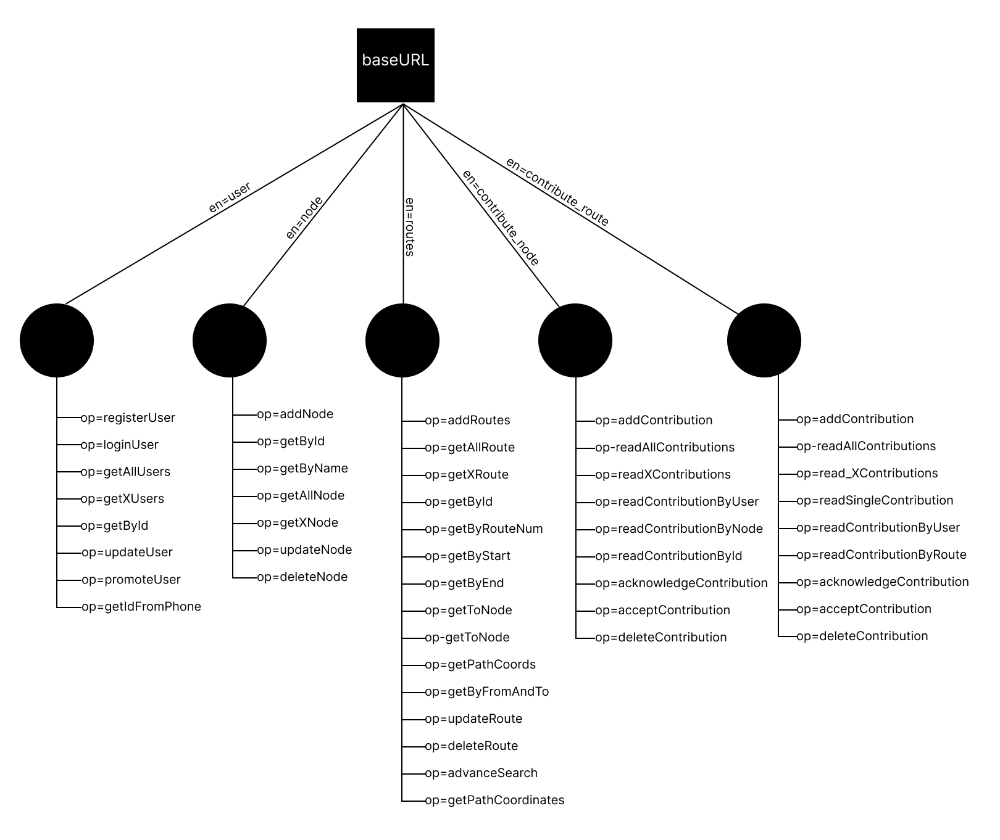

# KUN-GADI API
- By <a href="https://www.github.com/PG-Momik">Momik Shrestha

# Structure

# How to access data?
- Send JSON object to url and receive JSON data.

# Syntax
- base_URL?en=xyz&op=abc

# Example 1
- https://kungadi.000webhostapp.com/Api/index.php?en=user&op=updateUser"
- JSON object(load) => {"id": 1}

# Example 2
- https://kungadi.000webhostapp.com/Api/index.php?en=route&op=getByFromAndTo"
- JSON object => {"from": "Kirtipur", "to":"Swayambhu"} 
